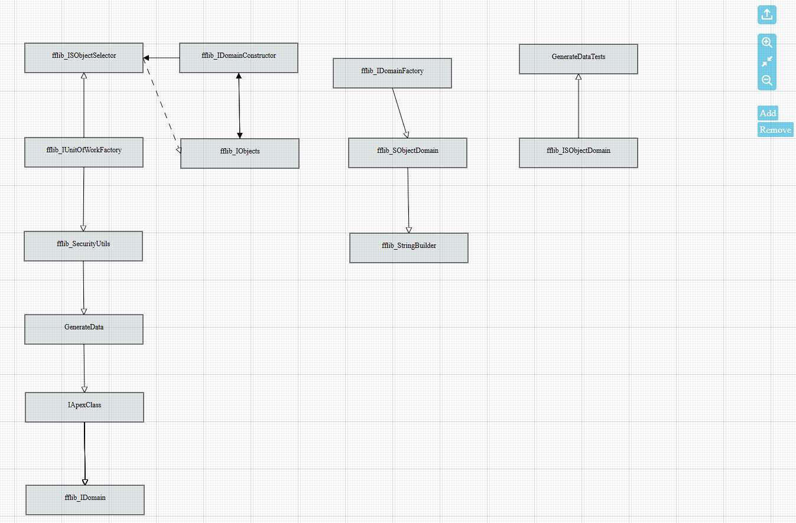

# UML Diagram Library

A lightweight, interactive JavaScript library for rendering UML class diagrams using D3.js and SVG.

## Features

- 🎨 **Interactive Diagrams** - Zoom, pan, and drag nodes
- 🎯 **Flexible Styling** - Customize colors, fonts, and node sizes
- 📦 **Lightweight** - Minimal dependencies
- 🔧 **Easy Integration** - Works with vanilla JS, modules, or bundlers
- 🎮 **Keyboard Controls** - WASD navigation, spacebar to center

## Installation

```bash
npm install @alesik/uml-diagram
```

Or via CDN (when published):
```html
<script src="https://unpkg.com/@alesik/uml-diagram/dist/main.js"></script>
```

## Quick Start

### HTML + Script Tag

```html
<svg id="uml-diagram" width="800" height="600"></svg>
<script src="./node_modules/@alesik/uml-diagram/dist/main.js"></script>
<script>
  const svgElement = document.querySelector("#uml-diagram");
  const diagram = new UMLDiagram.default(svgElement);
  
  diagram.setStyle({
    nodeForeground: "#333",
    nodeBackground: "#fff",
    fontFamily: "Arial, sans-serif",
    fontSize: "12px",
    nodeWidth: 200,
  });
  
  diagram.build();
</script>
```

### ES Modules

```javascript
import Diagram from '@alesik/uml-diagram';

const svgElement = document.querySelector("#uml-diagram");
const diagram = new Diagram(svgElement);

diagram.setStyle({
  nodeForeground: "#333",
  nodeBackground: "#fff",
  fontFamily: "Arial, sans-serif",
  fontSize: "12px",
  nodeWidth: 200,
});

diagram.build();
```

## API Reference

### Constructor

```javascript
const diagram = new Diagram(svgElement);
```

- `svgElement` - An SVG DOM element where the diagram will be rendered

An optional second argument configures interaction for this instance:

```javascript
const diagram = new Diagram(svgElement, {
  highlightIncidentLinksOnClick: true, // Default: false
  snapToNodes: true,                  // Default: true
  snapThreshold: 6,                   // Screen pixels; default: 6
});
```

When enabled, clicking a class selects its incoming/outgoing links too. With the default `false`, a class click selects only that class. This flag does not affect direct link clicks, `setHighlight({ includeIncidentLinks: true })`, or `addItems(data, { highlight: true })`.

### Alignment while dragging

Nodes snap to other nodes' left/right/top/bottom edges and horizontal/vertical centers while dragging. Each axis independently chooses the nearest alignment within `snapThreshold` screen pixels, including when the SVG is zoomed or scaled. This works for nodes with different widths/heights; it does not move neighboring nodes or rearrange the diagram automatically.

Dashed guides appear while snapped and disappear on release, when moving beyond the threshold, or when zooming/redrawing. Hold **Alt** while dragging to bypass snapping temporarily. The cursor's unsnapped coordinates are retained, so moving away releases the snap instead of accumulating position errors.

Set `snapToNodes: false` in the constructor to keep free dragging. `snapThreshold` accepts a finite nonnegative number (default `6`). Customize guide colors with the style API, including CSS variables:

```javascript
diagram.setStyle({ alignmentGuideColor: 'var(--diagram-guide, #e11d8d)' });
```

The final snapped coordinates are normal node positions in `getData()`, `nodeMoved`, and `layoutChanged`; movement events still fire once at the end of the drag. Guides are temporary, do not intercept clicks, do not affect the export bounds, and never appear in exported SVG or data. Highlight selections are preserved throughout dragging. See `examples/basic-usage.html` to try this alongside highlighting.

### Methods

#### `setStyle(style)`

Configure the visual appearance of the diagram.
You can also call this after `build()` to update the rendered SVG before exporting it.

```javascript
diagram.setStyle({
  nodeForeground: "#0f0f0f",      // Node border color
  nodeBackground: "#bfcace",      // Node background color
  fontFamily: "Arial, sans-serif", // Font family
  fontSize: "12px",               // Font size
  fontColor: "#0f0f0f",          // Text color
  nodeWidth: 200,                // Default node width
  nodeHeight: 50,                // Default node height
});
```

#### `build()`

Build and render the diagram. Call this after setting up the diagram.

```javascript
diagram.build();
```

#### `setData(data)`

Set the diagram data (nodes and links).

```javascript
diagram.setData({
  nodes: [
    {
      id: "Class1",
      name: "MyClass",
      namespace: null,
      width: 200,
      height: 100,
    },
  ],
  links: [
    {
      source: "Class1",
      target: "Class2",
      type: "Inheritance",
    },
  ],
});
```

#### `getData()`

Get a snapshot of the current diagram data.

The returned object contains copies of nodes and links, so changing it will not mutate the internal diagram state. Node `x` and `y` values reflect the current coordinates, including positions changed by drag-and-drop.

```javascript
const data = diagram.getData();
console.log(data.nodes.map(node => ({ id: node.id, x: node.x, y: node.y })));
```

Returns:

```typescript
{
  nodes: [
    {
      id: string;
      name: string;
      x: number;
      y: number;
      width: number;
      height: number;
    },
  ];
  links: [
    {
      source: string;
      target: string;
      type: string;
    },
  ];
}
```

#### `setHighlight(selection)`, `clearHighlight()`, `getHighlight()`

Highlight a temporary selection without changing data, layout, or persistent styling:

```javascript
diagram.setHighlight({
  nodeIds: ['Service', 'pkg.Logger'],
  links: [{ source: 'Service', target: 'pkg.Logger', type: 'Directed Association' }],
  includeIncidentLinks: false,
});
const selection = diagram.getHighlight(); // { nodeIds, links }; fresh arrays and objects
diagram.clearHighlight();
```

Each call replaces the previous selection. Unknown/removed items are ignored and duplicates are deduplicated. Empty input (including `setHighlight()`) clears the selection. Nodes use their stable IDs, never display names. Links have no separate ID in this library: their identity is the exact directed tuple `(source, target, type)`. Different relationship types and reverse links remain distinct; duplicate links with the same tuple are highlighted together.

`includeIncidentLinks: true` selects all incoming and outgoing links touching the selected nodes, without selecting neighboring nodes. Explicit links work even with an empty `nodeIds` list. Incident links are resolved when `setHighlight` is called; newly inserted links are not automatically selected later.

A click on a node (including its text) selects that node; if the constructor option `highlightIncidentLinksOnClick` is `true`, it also selects all incoming/outgoing links. A click on a link selects only that link. Shift+click adds or removes items from the current selection. With the flag enabled, selecting a node includes its incident links and deselecting it removes those links except ones touching another selected node. With the flag disabled, Shift+click on a node leaves selected links unchanged. Shift+click on a link always toggles that link independently. A plain click on empty SVG canvas clears highlighting; Shift+click on empty canvas leaves it unchanged. External controls, context menus, node dragging, panning and zooming preserve the selection. There is no timeout. Highlighting survives redraws and `addItems`; `removeItems` prunes removed nodes and their links. It is excluded from `getData()`, `layoutChanged` payloads and SVG export, and highlighting alone never emits `layoutChanged`. Programmatic `setHighlight` continues to use the explicit `includeIncidentLinks` option (default `false`).

Configure highlights through the existing style API:

```javascript
diagram.setStyle({
  highlightNodeOutline: 'var(--diagram-accent, #2563eb)',
  highlightNodeFill: null, // Optional subtle fill; null preserves the normal fill
  highlightLinkColor: 'var(--diagram-accent, #2563eb)',
  highlightStrokeWidth: 3,
});
```

Defaults are `#2563eb` for outline/link color, `null` for fill and `3` for stroke width. Highlight color values retain CSS variables, so variables inherited by the SVG can respond to light/dark themes without resetting the selection. A supplied node fill retains the normal fill opacity. Clearing restores the original item styles; calling `setStyle` while selected updates the underlying default theme as usual.

Subscribe with the existing event API:

```javascript
const unsubscribe = diagram.on('highlightChanged', ({ nodeIds, links, reason }) => {
  // Synchronize your sidebar selection here without dispatching its selection action again.
  sidebar.setSelectedIds(nodeIds);
});
```

Events are synchronous and fire only when the effective set changes, irrespective of input ordering or duplicates. Reasons are `api` (`setHighlight`/`clearHighlight` or highlighted addition), `click` (node/link click or Shift+click), `background` (empty canvas click), and `removal` (deleted items pruned during redraw). Every listener receives its own snapshot. Reapplying the same effective selection emits nothing, preventing feedback loops; a sidebar should still avoid writing a different selection back from its event handler. Call the returned function to unsubscribe.

To highlight only newly expanded dependencies, compute the difference **before** inserting:

```javascript
const key = ({ source, target, type }) => JSON.stringify([source, target, type]);
const before = diagram.getData();
const knownNodes = new Set(before.nodes.map(node => node.id));
const knownLinks = new Set(before.links.map(key));
const added = {
  nodes: expanded.nodes.filter(node => !knownNodes.has(node.id)),
  links: expanded.links.filter(link => !knownLinks.has(key(link))),
};
diagram.addItems(added);
diagram.setHighlight({ nodeIds: added.nodes.map(node => node.id), links: added.links });
```

The consumer should also deduplicate its incoming batch and ensure link endpoints exist. `addItems` does not automatically highlight unless explicitly requested with `{ highlight: true }`, so initial diagram restoration stays unselected. The existing library stores diagram data/default styles in a singleton; highlighting is instance-local, but this change does not make multiple diagrams' data independent.

#### `exportSvg(style)`

Export the diagram SVG as a string. By default, export fits the SVG `viewBox`, `width`, and `height` to the full diagram content, so nodes outside the current viewport and the current zoom/pan transform do not crop the exported SVG.

Pass optional export-only colors to serialize the diagram differently from the on-screen theme.

Export operates on a detached SVG copy: it never changes the rendered diagram or its highlighting. Temporary highlights are always omitted; there is no `includeHighlight` option.

```javascript
const svgString = diagram.exportSvg({
  background: "#ffffff",
  nodeForeground: "#111111",
  nodeBackground: "#ffffff",
  fontColor: "#111111",
  fitContent: true,
  padding: 24,
});
```

This is useful when the diagram is displayed as light elements on a dark background, but exported as dark elements on a light background.

`fitContent` defaults to `true`. Use `padding` to control the margin around the exported content. To export the current SVG viewport instead, pass `fitContent: false`.

Print-friendly export example:

```javascript
const svg = diagram.exportSvg({
  background: "#ffffff",
  nodeForeground: "#111111",
  nodeBackground: "#ffffff",
  fontColor: "#111111",
  padding: 24,
});
```

#### `addItems(data, options?)`

Add new nodes and links to the existing diagram.

```javascript
diagram.addItems({
  nodes: [{ id: "NewClass", name: "NewClass" }],
  links: [{ source: "Class1", target: "NewClass", type: "Association" }],
});
```

The optional settings object defaults to `{ highlight: false }`. Pass `highlight: true` to replace the selection with the new node IDs and link identities in this insertion:

```javascript
diagram.addItems({
  nodes: [{ id: 'Logger', name: 'Logger' }],
  links: [{ source: 'Service', target: 'Logger', type: 'Directed Association' }],
}, { highlight: true });
```

A settings class is also available. Both forms have the same behavior:

```javascript
import Diagram, { AddItemsOptions } from '@alesik/uml-diagram';

const options = new AddItemsOptions({ highlight: true });
diagram.addItems(newData, options);

// With the browser UMD build, the class is available on the constructor:
const browserOptions = new UMLDiagram.AddItemsOptions({ highlight: true });
```

Only identities absent before insertion are highlighted. Duplicate existing IDs/links are not considered new; an empty addition or a batch with no new identities preserves the previous selection. This option does not deduplicate the inserted data or change existing append behavior. The highlight event (reason `api`) occurs after rendering and before the usual `layoutChanged` event. Settings are not stored in nodes, links or exported data. Existing calls with one argument preserve highlighting as before.

#### `on(eventName, listener)`

Subscribe to diagram events. Returns an unsubscribe function.

Supported events:

- `"highlightChanged"` - emitted when the effective temporary node/link selection changes; see highlighting above.
- `"layoutChanged"` - emitted after a drag-and-drop move ends, and after `addItems()` or `removeItems()` changes the diagram.
- `"nodeMoved"` - emitted after a single node drag-and-drop move ends.
- `"nodeContextMenu"` - emitted after right-clicking a node.

```javascript
const unsubscribe = diagram.on("layoutChanged", (data) => {
  saveLayout(data.nodes.map(node => ({
    id: node.id,
    x: node.x,
    y: node.y
  })));
});

unsubscribe();
```

`layoutChanged` listeners receive the same data shape as `getData()`. The event is emitted after drag ends, not on every drag tick.

```javascript
diagram.on("nodeMoved", ({ node, data }) => {
  console.log(node.id, node.x, node.y);
  console.log(data.nodes);
});

diagram.on("nodeContextMenu", ({ node, data, event }) => {
  console.log(node.id, node);
  console.log(data.nodes);
  console.log(event.clientX, event.clientY);
});
```

#### `removeItems(itemIds)`

Remove nodes and their associated links.

```javascript
diagram.removeItems(["Class1", "Class2"]);
```

#### `getZoom()`

Get the zoom controller for programmatic zoom/pan operations.

```javascript
const zoom = diagram.getZoom();
zoom.zoomIn();
zoom.zoomOut();
zoom.resetZoom();
zoom.panLeft();
zoom.panRight();
zoom.panUp();
zoom.panDown();
zoom.center();
```

## Data Format

### Node

```typescript
{
  id: string;           // Unique identifier (required)
  name: string;         // Display name (required)
  namespace?: string;   // Optional namespace
  width?: number;       // Node width (default: from style)
  height?: number;      // Node height (default: from style)
  x?: number;           // Initial X coordinate (optional - auto-placed if not provided)
  y?: number;           // Initial Y coordinate (optional - auto-placed if not provided)
  group?: number;       // Optional grouping
}
```

**Initial Coordinates**: You can specify `x` and `y` coordinates to control node placement. If not provided, the library uses an improved auto-placement algorithm that minimizes line crossings by organizing nodes in layers based on their connections.

### Link

```typescript
{
  source: string;       // Source node ID (required)
  target: string;      // Target node ID (required)
  type: string;        // Link type: "Inheritance", "Realization", "Association", etc.
}
```

## Examples

See the `examples/` directory for complete working examples:

- `basic-usage.html` - Setup, add-and-highlight dependencies, external multi-class selection, clearing on empty canvas, zoom and export. Serve the repository over HTTP so its ES modules can load.



## Development

```bash
# Install dependencies
npm install

# Build for development
npm run build:dev

# Build for production
npm run build

# Watch mode
npm run watch

# Unit tests
npm test -- --runInBand

# Browser tests (builds first; requires locally installed Google Chrome)
npm run test:browser
```

Browser tests use Playwright as a development dependency only. Set `PLAYWRIGHT_CHANNEL=msedge` to use installed Edge instead. The test server binds to a temporary port on `127.0.0.1` and serves the basic usage example.

## Browser Support

- Chrome (latest)
- Firefox (latest)
- Safari (latest)
- Edge (latest)

## Dependencies

- **d3** (^7.0.0) - For SVG manipulation and interactions
- **lodash** (^4.17.21) - Utility functions

## License

MIT License - see [LICENSE](LICENSE) file for details.

## Contributing

Contributions are welcome! Please feel free to submit a Pull Request.

## Changelog

### Unreleased
- Add node alignment snapping with temporary edge/center guides, zoom-aware tolerance, and Alt bypass (`snapToNodes`, `snapThreshold`, `alignmentGuideColor`).
- Make incident-link selection on class clicks opt-in with the instance option `highlightIncidentLinksOnClick` (default `false`); enable it explicitly in basic usage.
- Support click selection and Shift+click toggling of nodes and links.
- Add optional `addItems(data, { highlight: true })` behavior and the `AddItemsOptions` settings class.
- Avoid emitting node movement/layout events for clicks without dragging.
- Add temporary node/link highlighting and `highlightChanged` events.
- Preserve highlight state through redraw, drag and zoom; clear on an empty canvas click.
- Export SVG from a detached copy with temporary highlighting omitted.
- Demonstrate highlighting and external selection in basic usage; add unit/browser coverage.
- Remove VS Code-specific stroke overrides from node dragging.

### 0.1.0
- Initial release
- Basic UML diagram rendering
- Interactive zoom and pan
- Node drag and drop
- Customizable styling
